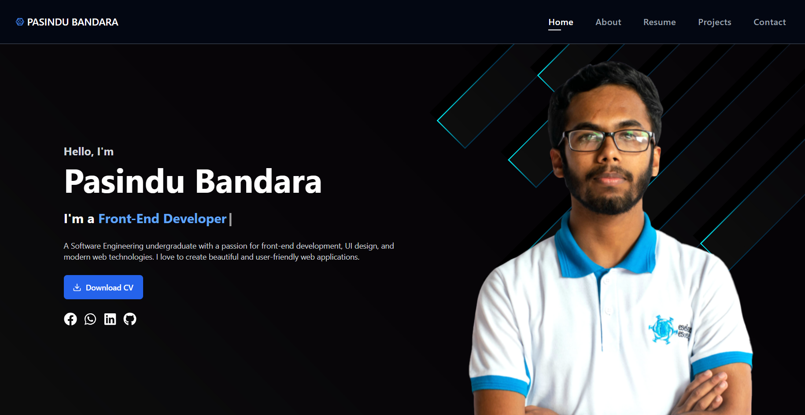

# My Portfolio Website

A personal portfolio website showcasing my projects, skills, achievements, and experiences. Designed with a modern and clean aesthetic, it highlights creativity and technical expertise while providing a user-friendly experience.

---

## 📋 Features

- **Project Showcase**: Display a collection of completed projects with descriptions and links.
- **Skills Section**: Highlight technical skills and expertise.
- **Achievements**: Present awards and recognitions.
- **Responsive Design**: Optimized for various devices, ensuring an excellent user experience.
- **Creative Layout**: Designed to reflect a modern and professional style.

---

## 🛠️ Technologies Used

- **HTML** and **CSS**
- **JavaScript**
- **React.js + Vite**
- **Tailwind CSS**

## 📸 Screenshot

